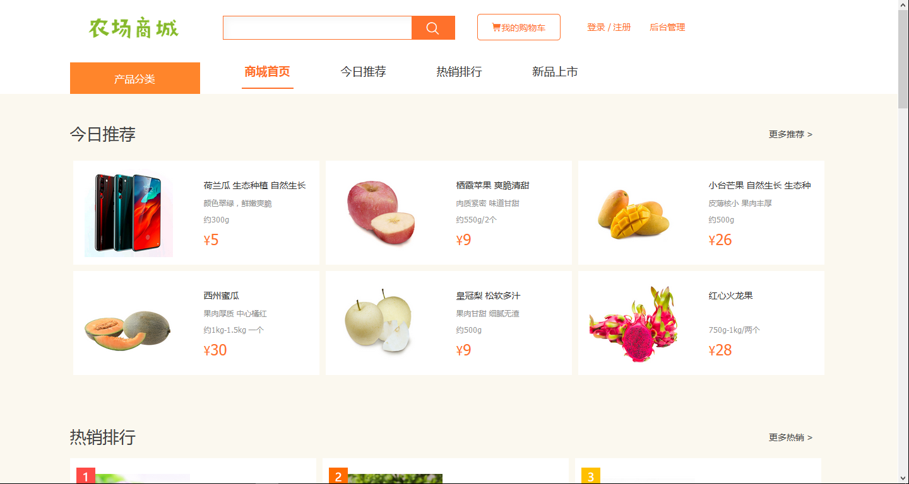
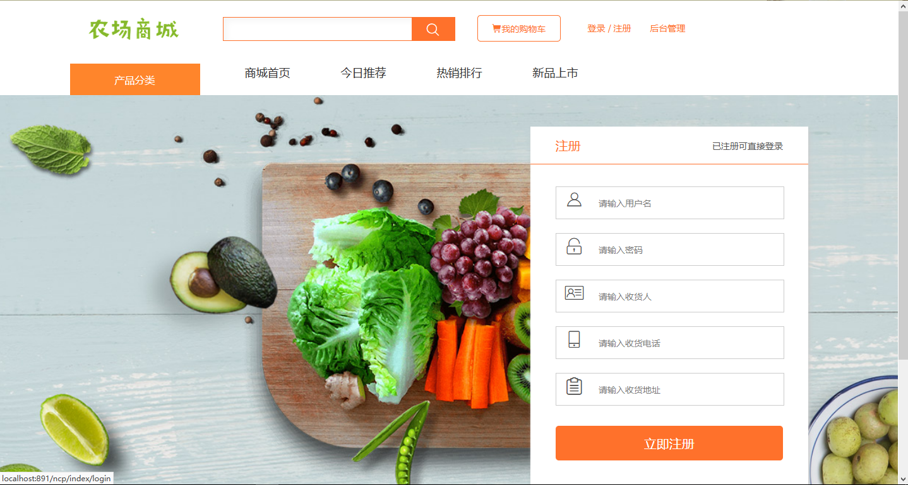

本系统是一个基于ssm且非maven的农产品购物系统（可修改为其他购物系统）

项目代码已收录公众号【java项目源码】，需要请自行关注一下公众号并下载源码

系统技术：spring,springmvc,mybatis,layui，jsp

系统有二种用户：

1、管理员：

分类管理，商品管理，订单管理，用户管理，设置管理员

2、买家：

登陆注册，查询查看商品，搜索商品，商品推荐，购物车，我的订单，收货地址，修改密码

默认后台用户: 用户名:admin 密码:admin

默认前台用户: 用户名:user 密码:user

CSDN博客地址：[基于ssm且非maven的农产品购物系统](https://blog.csdn.net/mataodehtml/article/details/116536170)

运行视频地址：[基于ssm且非maven的农产品购物系统](https://www.bilibili.com/video/BV1654y157Mw)

管理员：

